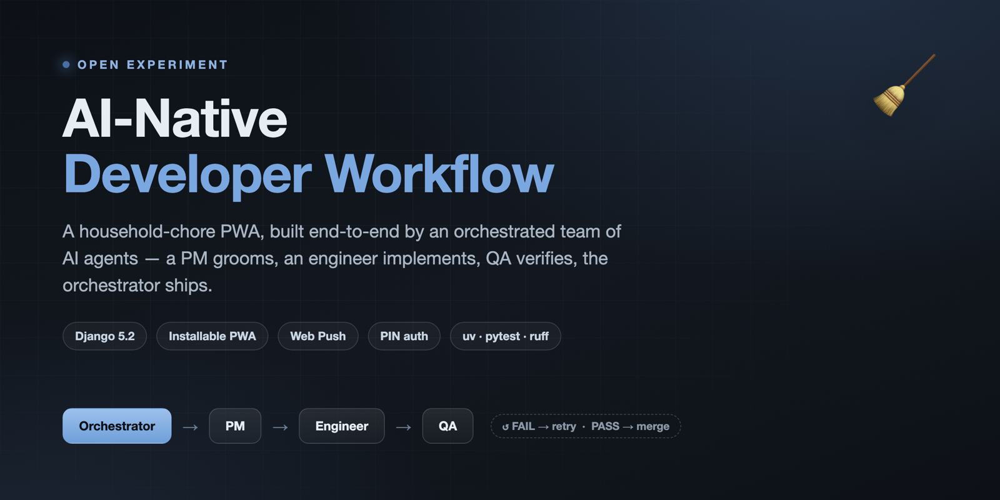

# AI-Native Developer Workflow




A working experiment in building a real application entirely through an
orchestrated team of AI agents. The codebase in this repo is the product of that
workflow; the workflow itself is documented in [`_docs/process.md`](_docs/process.md).

**The application:** a household chore tracker for a small household (think two
people, no admin hierarchy). It runs as a Django-backed, installable PWA — add it
to your phone's home screen, get nagged about overdue chores, and log who did
what.

- **What's being built and why:** [`_docs/plan.md`](_docs/plan.md)
- **How the work is organised** (orchestrator + PM / Engineer / QA agents):
  [`_docs/process.md`](_docs/process.md)
- **Agent role briefs:** [`_docs/team/`](_docs/team)

## Features

- **Chores with per-chore cadence** — daily, weekly, monthly, or a custom
  interval in days, each with its own anchor date.
- **Owned and pooled chores** — a chore either belongs to one person or sits in a
  free-for-all pool that anyone can claim (last claim wins) and complete.
- **Completion log** — every completion records who did it and when; not a
  checkbox that resets.
- **Recurrence engine** — pure functions compute the next due date and overdue
  state from the cadence, anchor, and last completion.
- **Chore list + recent activity** — a read-only dashboard grouped by owner, with
  "Overdue" / "Due today" badges.
- **PIN sign-in** — lightweight per-person auth with no full account system,
  plus brute-force lockout (per person+IP and per IP).
- **Installable PWA** — web app manifest, service worker, offline fallback page,
  and precaching of the app shell.
- **Web push subscription** — a signed-in person enables browser notifications
  from the settings page; each browser is stored as its own subscription.
- **Email nag digest** — a helper that emails a person a digest of the chores
  that need doing.

### Not wired up yet

- **Sending** web push notifications — subscriptions are captured, but signing
  and delivery (needs `pywebpush`) is a later task. See [`_docs/push.md`](_docs/push.md).
- **Scheduling** the email nag — `chores.notifications.send_nag_email()` exists
  and is tested, but nothing calls it on a schedule yet.
- **In-app chore management** — chores and people are created and edited in the
  Django admin; the app's own pages are read-only so far.

## Tech stack

| | |
|---|---|
| Language | Python 3.13+ |
| Framework | Django 5.2 (`>=5.1,<6.0`) |
| Database | SQLite |
| Frontend | server-rendered Django templates + PWA service worker |
| Tooling | [uv](https://docs.astral.sh/uv/), pytest, pytest-django, ruff |
| Config | environment variables via `django-environ` |

## Getting started

### Prerequisites

- [uv](https://docs.astral.sh/uv/)
- Python 3.13+ (uv will fetch one if needed)

### Setup

```bash
uv sync                              # install dependencies
cp .env.example .env                 # optional — sane defaults apply without it
uv run python manage.py migrate
uv run python manage.py seed_people  # create the two household members
uv run python manage.py runserver    # http://127.0.0.1:8000/
```

`seed_people` creates two people (default `Alex` / `Sam`, override with
`SEED_PERSON_1_NAME` / `SEED_PERSON_1_EMAIL` etc.). It is idempotent and never
touches an existing person's PIN.

### Give someone a PIN

New people have no usable PIN, so sign-in fails for them with the same generic
error as a wrong PIN. Set one:

```bash
uv run python manage.py set_pin alex@example.com   # prompts twice, no echo
```

Then sign in at `/login/` and sign out from the header.

### Create chores

Chores are managed in the Django admin. Create a superuser and use
`/admin/`:

```bash
uv run python manage.py createsuperuser
```

(The `Person` records used for sign-in are separate from Django's admin users.)

## Configuration

All configuration is read from the environment (or `.env`). See
[`.env.example`](.env.example) for the full list; everything has a development
default.

| Variable | Purpose | Default |
|---|---|---|
| `DEBUG` | Django debug mode | `True` |
| `SECRET_KEY` | Django secret key | insecure dev key |
| `ALLOWED_HOSTS` | comma-separated hosts | empty |
| `EMAIL_*` | SMTP settings for the nag digest | console backend (prints to stdout) |
| `VAPID_*` | Web Push keypair + admin email | empty (push disabled) |
| `PIN_LOCKOUT_*` | brute-force thresholds and window | 5 / 20 / 900s |

## Development

```bash
uv run pytest                              # full suite
uv run pytest chores/tests/test_smoke.py   # a single file
uv run ruff check .                        # lint
```

Dependencies are declared in `pyproject.toml` — add one there, not ad hoc.

## Project layout

```
config/            Django project (settings, root URLs, WSGI/ASGI)
chores/            the application
  models.py          Person, Chore, Completion, PushSubscription, PinLockout
  recurrence.py      pure next-due / overdue functions
  services.py        complete_chore, claim_chore
  auth.py            PIN verification and lockout
  notifications.py   send_nag_email digest
  views.py           chore list, login, settings, PWA manifest + service worker
  management/commands/  seed_people, set_pin
  tests/
_docs/             plan, process, and design notes
```

## License

No license has been chosen yet; treat this repository as all-rights-reserved
until one is added.
